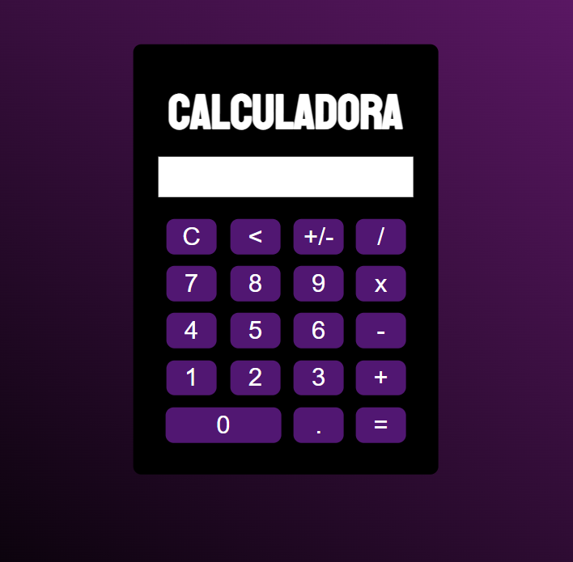

# Projeto Calculadora!

Um pequeno projeto de uma simples calculadora básica, coloquei em prática alguns conhecimentos que adquiri em JavaScript. 
 
Restam algumas melhorias para serem feitas que estarei implementando conforme for melhorando na linguagem e buscando mais conhecimento, porém, para algum uso básico e
de cálculos simples, ela quebra um galho :chopsticks:.
 

